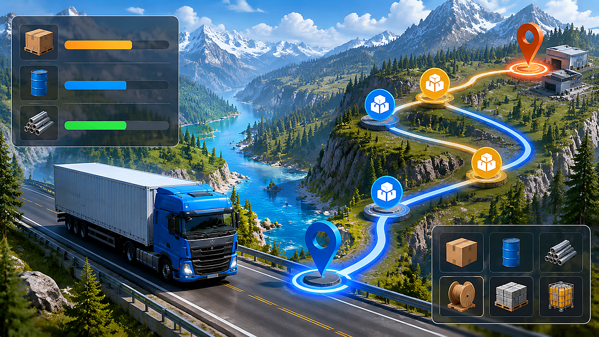

# 卡车人生下载后怎么玩：新手路线与货运调度实用指南

> 本文整理卡车人生下载后的前几个小时玩法，重点解决“先买什么车、怎样接单、路线怎么规划”这三个新手最容易卡住的问题。页面资料可在 [卡车人生下载与新手资料](https://truck.youxiw88.com/) 中继续查看。

**适用场景：** 手机端新手入门　**内容类型：** 货运路线与资金规划　**更新时间：** 2026 年 8 月

## 一、先把第一笔资金用在能提高周转的地方

刚开始不要急着追求外观或高等级车辆。新车的核心指标是载重、油耗、维修费用和可接订单范围。建议先保留一笔维修和补给资金，再把剩余预算投入到能够稳定跑短途的车辆配置上。短途订单虽然单笔收益不高，但往返时间短，适合熟悉路况，也能较快积累升级所需的现金流。

接单前可以按下面的顺序检查：

1. 目的地是否在当前已解锁区域内；
2. 货物重量是否接近车辆安全载重；
3. 报酬是否覆盖油费、过路费和可能的维修费；
4. 送达时间是否允许中途补给；
5. 返回路线是否有顺路订单。

把这五项做成固定习惯后，前期很少会出现“赚了运费却亏在路上”的情况。

## 二、短途和中途订单怎么搭配

新手阶段可以采用“短途熟悉地图，中途拉高收益”的节奏。连续完成两到三个短途订单后，熟悉了城市入口、加油点和维修点，再选择一条中途路线。不要一开始就接最长距离，因为路线中任何一次绕行都会放大油耗和时间成本。

| 订单类型 | 适合阶段 | 主要目标 | 接单建议 |
| --- | --- | --- | --- |
| 城市内短途 | 刚开始 | 熟悉操作与道路 | 优先选择高频、少收费站的路线 |
| 城市间中途 | 有基础车辆后 | 提高单次净收益 | 选择返程有货的城市组合 |
| 长距离运输 | 车辆与资金稳定后 | 解锁区域与成就 | 先确认补给点，再考虑时限 |

## 三、路线规划的三个细节

第一，出发前看地图上的道路等级。高速路线通常更快，但收费和入口位置会影响最终收益；普通道路速度较慢，却可能更适合车辆等级较低的阶段。第二，把加油和维修安排在顺路节点，尽量不要为了补给折返。第三，预留天气或突发事件的时间。遇到视野降低、道路拥堵时，宁可提前出发，也不要把时限压到最后几分钟。

如果一条路线连续两次出现亏损，可以记录四个数据：出发油量、到达油量、实际耗时、额外支出。对比后通常能发现问题来自路线绕行、车辆配置不匹配或订单报酬偏低，而不是单纯的操作失误。

## 四、车辆升级顺序

推荐优先升级影响周转的项目，再处理外观类内容：

- **动力与制动：** 减少起步迟滞和复杂路段的风险；
- **油箱与续航：** 让中途订单少一次补给；
- **载重能力：** 提升可接订单范围；
- **耐久与维修：** 降低连续跑单时的停工时间；
- **外观装饰：** 在现金流稳定后再投入。

这样的顺序并不追求一次性把车升满，而是让每次投入都能尽快转化为下一单的收益。

## 五、手机端操作的小技巧

手机端更适合把常用按钮放在拇指容易触达的位置。接单前先放大目的地附近的地图，确认入口方向，再开始行驶；进入陌生城市时不要只看导航线，还要观察道路编号和转弯提示。长途运输可以分成“出发、补给、交付”三个小阶段，每完成一段就检查一次车辆状态。

## 常见问题

### 前期应该追求高价单吗？

不建议只看总报酬。要用总报酬减去油费、通行费和维修费，再除以预计用时，得到每分钟的净收益，比较才有意义。

### 为什么同一条路收益不一样？

订单货物、车辆载重、道路选择和额外支出都会影响结果。记录两三次完整数据后再调整，比凭感觉换车更可靠。

### 什么时候适合跑长途？

当车辆有稳定续航、手头保留维修资金，并且已经熟悉至少一个补给点后再尝试。长途的价值在于解锁和高净收益，不在于盲目追求距离。

把路线规划、订单筛选和车辆升级连成一个循环，卡车人生下载后的成长会更稳定，也更容易找到适合自己的驾驶节奏。
