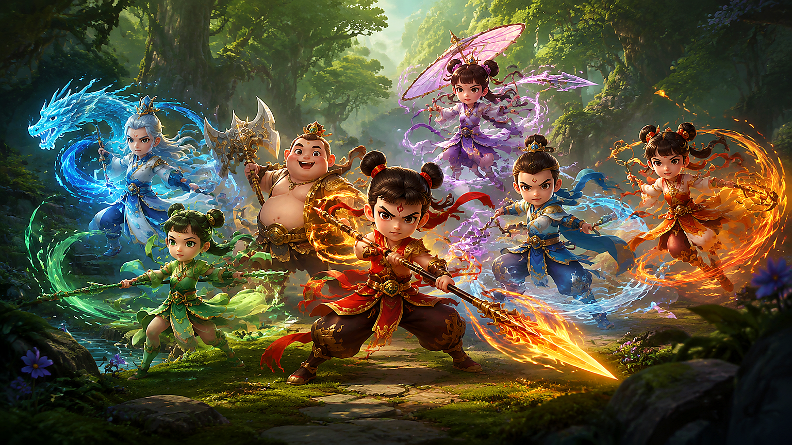

# 葫芦娃游戏下载后怎么玩：阵容搭配与关卡推进技巧

> 葫芦娃游戏下载后，前期最容易遇到的不是战力不足，而是阵容功能重复、技能释放时机不对。本文用关卡目标来拆解阵容选择，帮助新玩家更快建立稳定的推图队伍。游戏下载与资料整理可查看 [葫芦娃游戏下载攻略](https://huluwa.youxiw88.com/)。

**适用场景：** 手机端推图　**内容类型：** 阵容搭配与关卡策略　**更新时间：** 2026 年 8 月

## 一、先按关卡目标选择阵容

不同关卡的难点并不相同。有的关卡要求快速清理小怪，有的关卡需要扛住首领爆发，还有的关卡会持续施加减速或控制。阵容选择应先看胜利条件，再决定输出、承伤、控制和回复的比例。

一个容易上手的基础思路是“前排承伤 + 中排持续输出 + 后排范围或单体输出 + 一个功能位”。功能位可以根据关卡替换成回复、控制、驱散或增益，不必每一关都使用完全相同的队伍。

## 二、推图前的三分钟准备

进入关卡前，按顺序做三项检查：

1. 查看敌方数量和首领类型，判断需要范围还是单体伤害；
2. 检查主力角色的能量、装备耐久和技能冷却；
3. 把自动战斗设置为“关键技能保留”或手动释放模式。

很多失败不是数值差距造成的，而是控制技能在第一波小怪上全部用掉，到了首领阶段没有应对手段。提前保留一个打断或保护技能，往往能明显提高通关率。

## 三、常见阵容的使用场景

| 阵容方向 | 优点 | 适合关卡 | 操作重点 |
| --- | --- | --- | --- |
| 稳定推进型 | 容错率高 | 未知地图、连续战斗 | 保留回复和保护技能 |
| 范围清怪型 | 清场速度快 | 小怪数量多 | 注意首领阶段的输出衔接 |
| 单体爆发型 | 集火能力强 | 首领或精英关 | 控制技能配合爆发回合 |
| 控制消耗型 | 降低敌方行动 | 高伤害、难度关 | 控制不要重复覆盖同一目标 |

如果某个角色的技能只对特定目标有效，可以放到对应关卡使用，不必强行塞进所有日常阵容。灵活更换一个位置，通常比重复强化同一件装备更有效。

## 四、技能释放的节奏

开场先判断敌方行动顺序。若对方第一回合会释放群体伤害，保护技能应提前使用；若首领会在血量下降后进入强化阶段，则应把爆发和控制留到临界点。对于持续伤害型技能，尽量在敌方不会立即被击败时使用，保证效果完整覆盖。

自动战斗适合清理已经熟悉的低难度关卡，首次挑战或高难度关卡建议手动操作。手动时不必每一秒都点技能，只要掌握“首领读条、关键控制、队伍血量”三个节点即可。

## 五、资源怎么花才不浪费

主力队伍的等级和核心技能优先，替补角色只做基础解锁。装备强化先看主属性是否符合定位，再看套装或组合效果。活动期间的兑换顺序建议是稀有突破材料、核心技能材料、体力或挑战次数，最后才是可以长期刷取的普通资源。

每天清理任务时，可以把消耗体力的内容分成两组：一组用于当前队伍升级，另一组用于储备下一个突破阶段的材料。这样既能保持当日战力增长，也不会因为临时缺材料而停滞。

## 常见问题

### 阵容战力更高却打不过怎么办？

检查角色定位是否重复、技能是否被敌方克制，以及装备主属性是否正确。战力数字只能作为参考，关卡机制和技能节奏同样重要。

### 什么时候适合开启自动战斗？

完整手动通关并熟悉敌方行动后，再用自动战斗刷重复关卡。首次遇到新机制时，手动模式更容易及时调整。

### 资源应该平均培养所有角色吗？

不建议。先培养一支功能完整的主力队伍，再为特定关卡补充功能位，整体效率更高。

葫芦娃游戏下载后的成长重点，是先形成稳定的推图循环，再逐步扩展阵容。能看懂关卡目标、保留关键技能、按需调整功能位，远比盲目堆单项数值更可靠。
