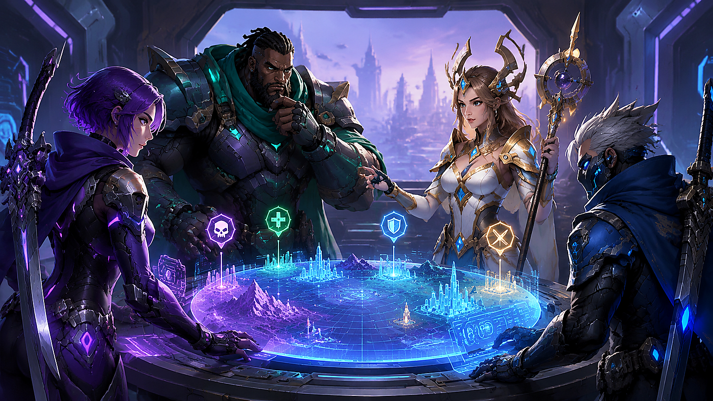

# 锚点降临下载后怎么养成角色：资源优先级与配队思路

> 锚点降临下载后，很多玩家会遇到“角色不少但资源不够”的问题。本文从前期推图、资源分配和队伍协作三个角度整理一套低浪费的养成顺序，更多版本资料可参考 [锚点降临下载与玩法资料](https://anchor.youxiw88.com/)。

**适用场景：** 手机端新手　**内容类型：** 角色培养与队伍搭配　**更新时间：** 2026 年 8 月

## 一、先确定队伍功能，而不是先把等级拉满

前期资源有限，最稳妥的做法是先确定队伍中的功能位置：主要输出、持续输出或辅助、承伤与控制、回复或增益。四个位置不一定要固定成四种角色，但队伍至少要有一个稳定的输出点和一个能处理突发情况的保护位。

可以先用一队完成主线，备用角色只做基础升级，等抽到适合的核心角色后再调整。这样能避免同时培养五六名角色，导致每个人都差一点关键技能。

## 二、前期资源投入顺序

资源投入可以分成“立即提升推图效率”和“长期保留价值”两类。普通经验材料和低级装备可以优先使用，稀有突破材料则应留给确定会长期使用的角色。

| 优先级 | 投入项目 | 判断标准 |
| --- | --- | --- |
| 1 | 主输出等级与关键技能 | 能明显缩短普通战斗时间 |
| 2 | 全队生存能力 | 面对高伤害关卡不容易被秒 |
| 3 | 关键装备主属性 | 属性方向与角色定位一致 |
| 4 | 辅助技能与速度 | 能稳定提供控制、回复或增益 |
| 5 | 外观和非必要收集 | 资源富余后再处理 |

不要被装备颜色牵着走。一个主属性正确、套装效果合适的普通装备，往往比属性不匹配的高稀有装备更实用。

## 三、如何判断角色是否值得投入

第一看技能循环是否顺手。技能需要长时间蓄力或依赖特定条件的角色，在新手阶段可能很难发挥；第二看队伍兼容性，能为多个阵容提供增益的辅助通常更耐用；第三看突破材料获取难度，材料过于分散会拖慢整体进度。

建议先打几轮低难度关卡测试角色：观察技能冷却、能量回复、自动战斗表现和手动操作容错率。测试结果比单看面板数值更能说明问题。

## 四、配队时注意行动顺序

队伍顺序会影响增益覆盖和技能衔接。一般可以让提供开场增益或控制的角色先行动，随后由主输出完成爆发，最后由回复或保护角色补足队伍状态。若关卡存在持续伤害，则应把解除异常或回复技能留到关键回合，不要一开始就全部交掉。

面对单体首领时，集中火力通常比平均削减更高效；面对多目标关卡时，可以保留一个范围技能处理第二波敌人。进场前看敌方的属性和行动模式，临时替换一个功能位，往往比硬堆战力更省资源。

## 五、装备与材料的整理方法

每天整理一次背包，把装备分成三组：当前使用、备用测试、分解或出售。强化材料优先用于主输出的武器或核心部位，辅助角色只需要达到技能循环稳定的程度。遇到限时活动时，先兑换稀有突破材料，再考虑经验和金币，因为经验和金币通常有更多获取渠道。

可以在备忘录记录每名角色的三项数据：当前等级、下一个突破所需材料、关键技能等级。这样领取活动奖励时不会重复兑换，也不容易把稀有材料花在临时角色上。

## 常见问题

### 新手需要追求完美阵容吗？

不需要。先用一套功能完整的队伍推进主线，等资源和角色池稳定后再追求更高上限。

### 自动战斗打不过，应该先升谁？

先提升主输出的生存和技能循环，再检查队伍是否缺少保护或回复。单纯提高一个角色的攻击，未必能解决全队频繁倒下的问题。

### 低稀有装备要不要全部分解？

不要。保留主属性正确、强化成本低的装备，作为备用角色过渡；属性完全不匹配的再分解。

锚点降临下载后的前期目标不是把所有内容一次做完，而是用有限资源建立一支能够稳定通关、方便调整的队伍。养成节奏稳下来，后续版本变化也更容易适应。
