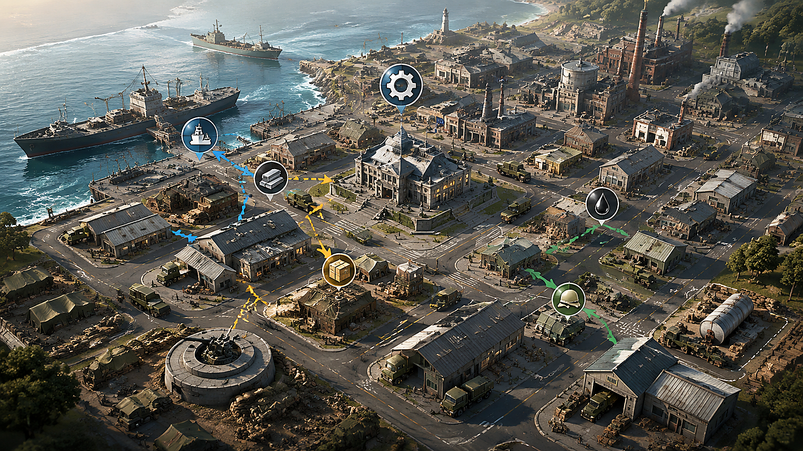

# 二战风云2手机端城市建设与资源规划

【二战风云2下载】 [二战风云2资料站](https://ww2.youxiw88.com/)　【二战风云2攻略】 [城市建设与资源规划](https://ww2.youxiw88.com/)

> 更新时间：2026-08-20　适用版本：以页面当前标注版本为准　适用设备：Android 手机和平板

搜索二战风云2下载的手机用户，通常需要先确认版本能否安装，再解决城市建设、资源分配和部队补给问题。本文按“安装前检查、开局建设、离线生产、出征准备”的顺序整理一套手机端清单，所有链接都指向[二战风云2资料站](https://ww2.youxiw88.com/)，便于在同一页面核对版本和攻略。

## 一、手机安装前检查

在打开[二战风云2下载入口](https://ww2.youxiw88.com/)前，先完成以下检查：

1. **确认系统版本**：对照页面标注的最低 Android 版本，系统过低时不要强行安装。
2. **预留存储空间**：除安装包本身外，还要为解压、首次更新和缓存预留空间。
3. **确认网络环境**：首次更新尽量使用稳定 Wi-Fi，避免中途切换网络导致资源校验失败。
4. **保留正常登录方式**：旧设备有进度时，先确认账号已完成正常绑定，再更新客户端。

安装完成后，先进入设置查看版本号和服务器信息。版本号与[二战风云2版本说明](https://ww2.youxiw88.com/)不一致时，优先完成正常更新，不要重复安装多个来源的文件。

## 二、开局城市建设顺序

手机端操作时间碎片化，更需要在每次上线时明确一个目标。建议按下面的顺序建立基础循环：

### 1. 先保证资源产出

优先补足当前最紧缺的基础资源建筑，让生产可以持续运行。不要同时把所有建筑升到同一等级，集中升级一条资源链更容易完成主线任务。

### 2. 再提升仓储容量

如果离线一段时间后资源经常达到上限，说明仓库容量已经限制了产出。此时先升级仓储，再安排长时间生产，避免资源在离线期间被浪费。

### 3. 按任务解锁功能

侦察、补给、运输等功能会影响后续行动效率。主线即将解锁新功能时，可以提前准备材料，但不要为了追求等级而消耗全部储备。

### 4. 最后扩大部队

部队规模要和资源产出、补给能力匹配。前期过早扩军，会让建筑升级和城市恢复都变慢。完成[二战风云2开局攻略](https://ww2.youxiw88.com/)中的基础建设目标后，再逐步增加部队。

## 三、手机端离线生产安排

下线前可以用三分钟完成一次检查：

- 领取已经完成的生产和任务奖励。
- 安排与预计离线时长匹配的建筑和生产队列。
- 确认仓库容量能容纳下一轮产出。
- 检查部队是否已经返回，补给是否处于安全范围。
- 预留下一次上线要完成的升级材料。

短时间离线适合安排快速生产，睡前或长时间离线再安排长周期任务。这样可以减少手机端频繁登录，也能避免队列空转。

## 四、出征前的资源安全线

出征前不要把仓库中全部资源都视为可用资源。建议预留下一项建筑升级、部队恢复和补给所需的基础储备，再决定出征规模。

首次前往新区域时，先用低风险部队测试行军时间和补给消耗，确认路线后再投入主力。遇到连接中断、战报延迟或资源没有及时更新，先回到主界面重新同步，不要连续重复提交操作。

## 五、常见问题排查

**安装后闪退**：检查系统版本、存储空间和后台应用，重启后再尝试正常更新。

**首次更新卡住**：切换稳定网络，清理临时缓存并重新启动；不要在更新过程中强制结束应用。

**资源总是不够**：检查是否同时升级了过多建筑，或部队规模已经超过当前产出能力。

**账号进度没有同步**：确认登录方式和服务器选择，记录错误提示后通过正常客服渠道处理。

## 总结

手机端玩二战风云2，核心是把安装核对、城市生产、仓储容量和部队补给串成稳定循环。先从[二战风云2下载与版本入口](https://ww2.youxiw88.com/)确认客户端，再按本文清单安排城市建设，能减少重复安装和资源浪费。
